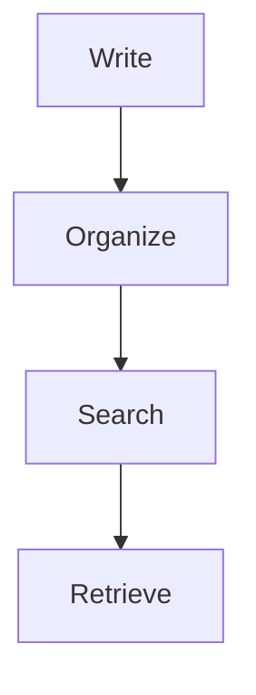

# Opsly MD

Local-first Markdown workspaces that run entirely in your browser.

No accounts. No servers. No tracking.

Your notes, documentation, and knowledge base stay on your device.

## Features

### Organize

* Workspaces and folders
* Nested document organization
* Fast navigation between documents
* Import and export your data anytime

### Search

* Search across your entire workspace
* Section-aware search results
* See exactly where matches live before opening a document
* Jump directly to matching content

### Retrieve

* Find relevant information across your documentation
* Surface the sections that answer your question
* Navigate directly to the source content

### Write

* GitHub Flavored Markdown
* Syntax highlighting
* LaTeX (KaTeX)
* Mermaid diagrams

## Why Opsly MD?

Most documentation tools require:

* Accounts
* Cloud storage
* Subscription plans
* Vendor lock-in

Opsly MD keeps things simple.

Open the app and start writing.

Your data never leaves your browser unless you choose to export it.

## Example

```bash
kubectl apply -f deployment.yaml
```

Inline math:

$a^2 + b^2 = c^2$

Mermaid diagrams:



## Philosophy

* Local-first
* Privacy by default
* No lock-in
* Fast and simple tools
* Your data belongs to you

## Get Started

* Open App: https://md.opsly.dev
* GitHub: https://github.com/iaminci/opsly-md

## VS Code Extension

Preview `.md` files in VS Code with the same rendering pipeline as the web app — GFM, syntax highlighting, KaTeX, Mermaid, and Opsly secure code fences.

See [`vscode-extension/README.md`](vscode-extension/README.md) for usage, development, and packaging instructions.
